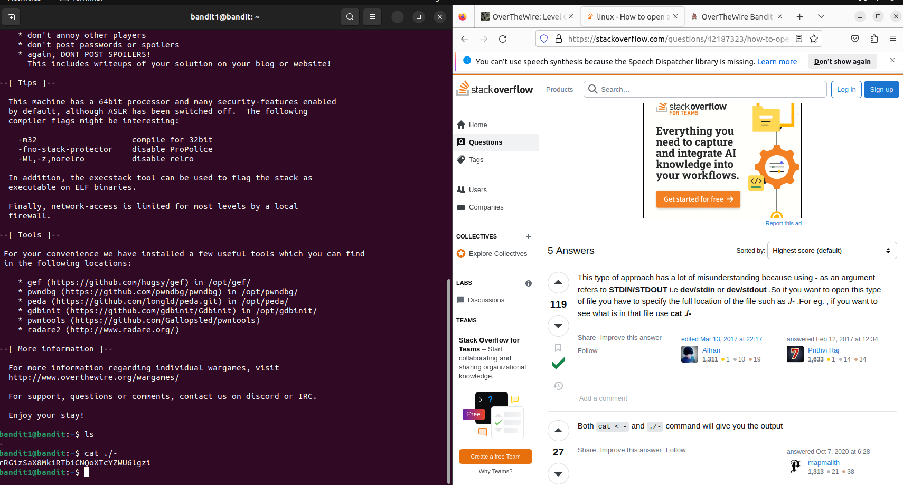

# Bandit1

Sau khi lấy được password ở bandit0 và dăngd nhập vào bandit1. 

Em thực hiện lại lệnh ls để xem những file, folder.

Ta thấy có 1 file có tên là một ký tự đặc biệt 1 dấu "-", ta không thể dùng lệnh cat thông thường để đọc được.

Bằng cách tra google để xem cách đọc file có ký tự "-", em đã tìm ra password.

