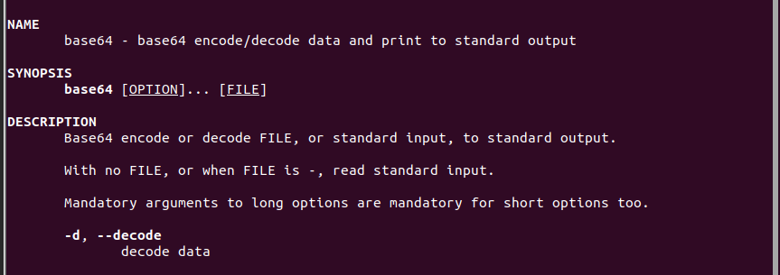

# Bandit10 -> bandit11

> Hint: The password for the next level is stored in the file data.txt, which contains base64 encoded data

Ta thấy có file data.txt, dựa vào hint thấy được đây là dữ liệu lưu ở dạng base64

Dùng lệnh `man base64` để xem các tuỳ chọn ta biết được cách decode

Áp dụng vào ta lấy được password

