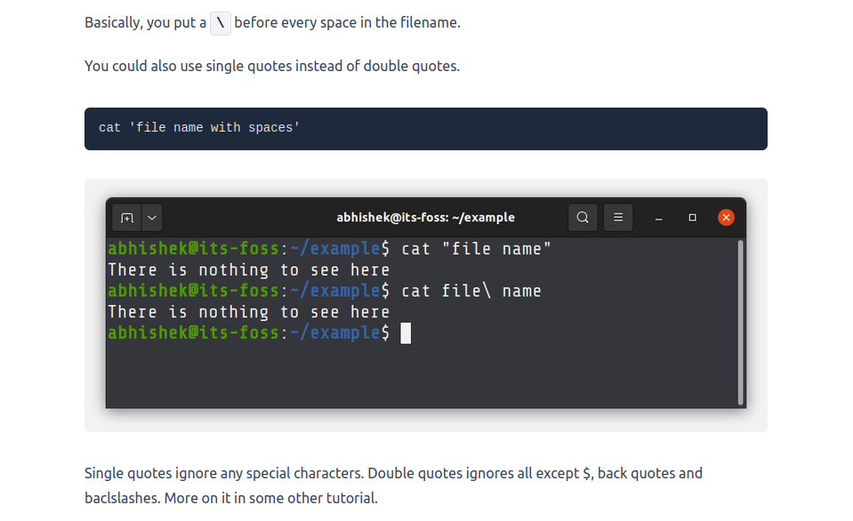
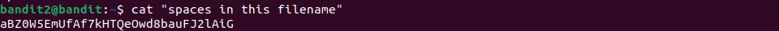

# Bandit2 -> Bandit3

Dùng lệnh ls ta thấy có file có khoảng trắng.

Dùng google ta biết được cách đọc loại file này bằng cách thêm "\' giữa các từ hoặc bỏ tên file vào dấu nháy kép 

Ta có được password

> Password:  **aBZ0W5EmUfAf7kHTQeOwd8bauFJ2lAiG**
