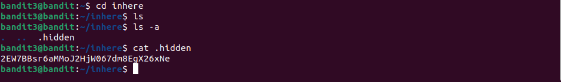

# Bandit3 -> Bandit4

Dùng lệnh `ls -a` để có thể xem toàn bộ file.

Dùng lệnh `cd inhere` để vào thư mục inhere

Dùng tiếp lệnh `ls -a` để xem toàn bộ file, ta thấy và đọc file .hidden thì lấy được password

