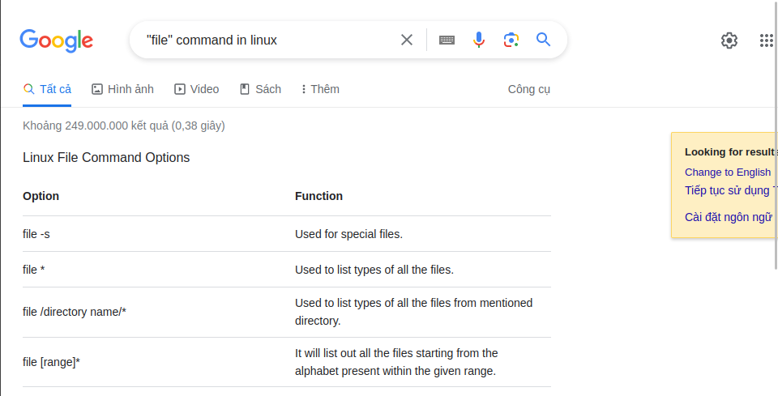
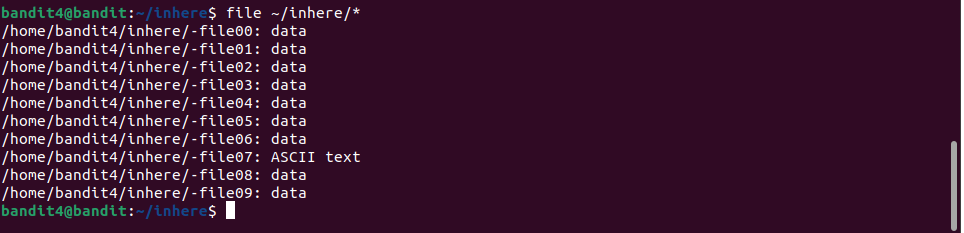
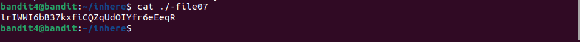

# Bandit4 -> Bandit5

> Hint: The password for the next level is stored in the only human-readable file in the inhere directory. Tip: if your terminal is messed up, try the “reset” command.

Như Bandit3 ta lại dùng các lệnh `ls`, `cd` để di chuyển vào thư mục inhere rồi thấy được rất nhiểu file nhưng không rõ loại file.

Dùng google ta biết được lệnh `file` có chức năng xem được loại của file.

Dùng lệnh `file ~/inhere/*`  để có thể xem được từng loại file cho tất cả file ở trong thư mục inhere, dấu `*` đại diện cho tất cả file trong thư mục.

Nhận thấy có file07 có thể đọc nên ta dùng lệnh `cat` để đọc và lấy được password.

