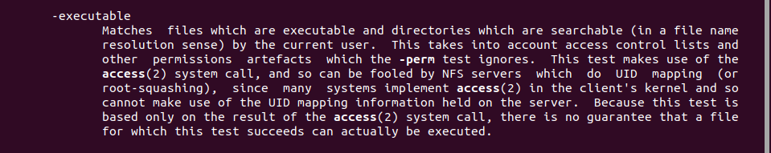

# Bandit5 -> Bandit6

> Hint:
> 
> The password for the next level is stored in a file somewhere under the inhere directory and has all of the following properties:
> 
>   human-readable
>
>   1033 bytes in size
>
>   not executable

Như bài trước ta dùng lệnh `ls, cd` để vào thư mục inhere và lệnh `ls -a` để xem toàn bộ folder.

Sử dụng lệnh `man find` ta thấy 2 thông tin có liên quan tới hint bên trên.

Dùng google tra cách dùng lệnh `find`

Dùng lện `find` dựa theo hint `1033 bytes in size` của đề ta thấy được 1 file trùng khớp, sau đó ta dùng lệnh `cat` để đọc file thì lấy được password mà chưa dùng tới hint `not executable`.

