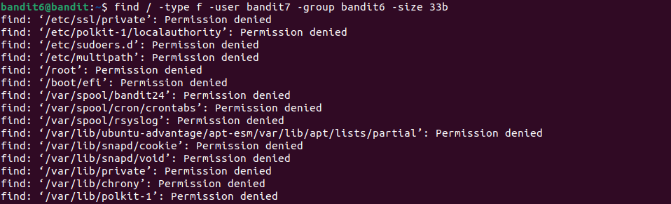

# Bandit6 -> Bandit7

>Hint
>
>The password for the next level is stored somewhere on the server and has all of the following properties:
>
>owned by user bandit7
>
>owned by group bandit6
>
>33 bytes in size

Như thói quen ta dung `ls -a` để xem nhưng không có gì hữu ích.

Tra google ta biết được cách tìm file theo owned và group theo cú pháp `find / -type f -user username -group groupname -size size`

Áp dụng vào thì ra một đống `Permission denied`.

Tra google về vấn đề trên ta có giải pháp:

Áp dụng lại ta tìm được file khớp với yêu cầu, sử dụng lệnh `cat` ta lấy được password.

> Password: **z7WtoNQU2XfjmMtWA8u5rN4vzqu4v99S**
