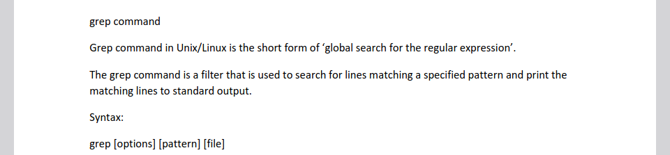
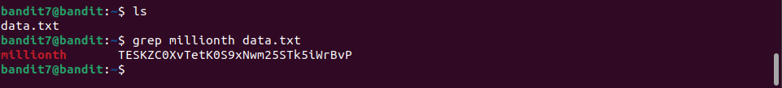

# Bandit7 -> Bandit8

> Hint: The password for the next level is stored in the file `data.txt` next to the word `millionth`

Truy cập vào ta thấy có 1 file `data.txt`.

Dựa vào hint ta tra google cách dùng lệnh `grep`

Áp dụng vào với tham số là `millionth` và `data.txt` ta có được password.

> Password: **TESKZC0XvTetK0S9xNwm25STk5iWrBvP**
