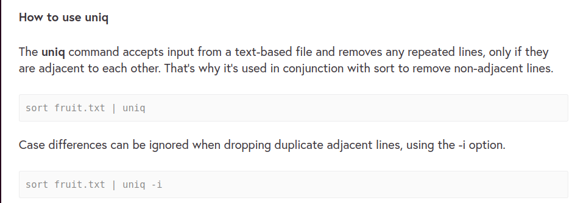
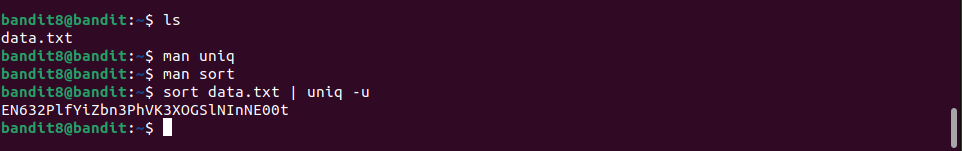

# Bandit8 -> Bandit9

>Hint:
>
>The password for the next level is stored in the file data.txt and is the only line of text that occurs only once

Kết nối tới server ta lại thấy 1 file data.txt.

Từ hint ta thấy rằng password được lưu theo cách đặc biệt chỉ xuất hiện trên 1 dòng 1 lần duy nhất và lệnh `uniq -u` có thể xử lý được trường hợp này với chức năng lọc đi những dòng bị lặp nhưng chỉ áp dụng với những dòng liền kề nên ta dùng kết hợp với lệnh `sort` để tránh trường hợp những dữ liệu trùng lặp không liền kề nhau.

Áp dụng theo ta lấy được password

