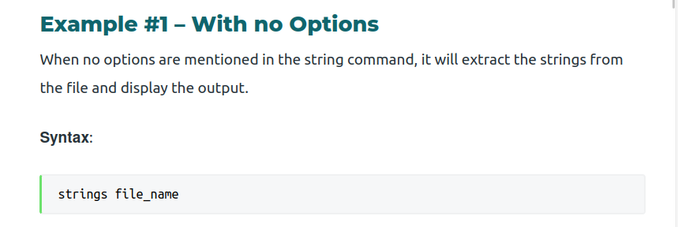
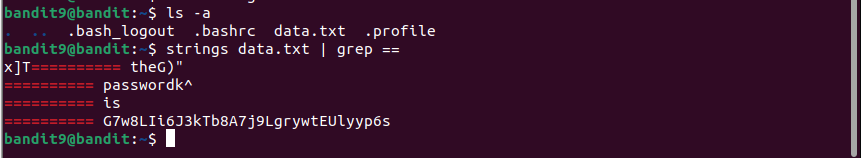

# Bandit9 -> Bandit10

>Hint: The password for the next level is stored in the file data.txt in one of the few human-readable strings, preceded by several ‘=’ characters.

Dựa vào hint ta thấy có 1 lệnh mới `strings`, và password ở gần một vài ký tự `=`.

Tra cách sử dụng lệnh `strings`.

Ta kết hợp với lệnh `grep` để tìm ra những dòng có dấu `=` bằng ký tự `|` ta lấy được password

> Password: **G7w8LIi6J3kTb8A7j9LgrywtEUlyyp6s**
